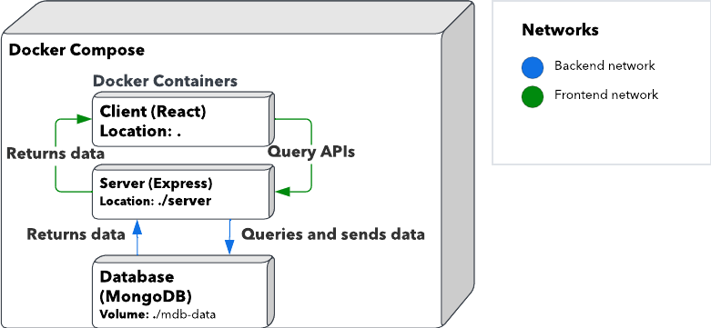

# IT5007 Project
This README is for running the project. \
For project overview and docs, please refer to: [Project Overview](https://antheajfw.github.io/IT5007-Project/?path=/story/it5007-project-problem-formulation--page)

## Development
### Requires
- [yarn](https://yarnpkg.com/getting-started/install)

Once installed, run:
```bash
yarn install
```

### Running the app for development
```bash
yarn start
```

Runs the app in the development mode.\
Open [http://localhost:3000](http://localhost:3000) to view it in your browser.

The page will reload when you make changes.\
You may also see any lint errors in the console.

### Testing the app
```bash
yarn test
```
Launches the test runner in the interactive watch mode.\
See the section about [running tests](https://facebook.github.io/create-react-app/docs/running-tests) for more information.

### Building the app
```bash
yarn build
```
Builds the app for production to the `./server/public` folder for use with express app.\
It correctly bundles React in production mode and optimizes the build for the best performance.

Once built, run the server with
```bash
cd server
yarn start # Development
yarn serve # Production
```

### Updating storybook docs
- [ ] Todo: Make this a pre-commit hook

Before commiting to main repo, should there be any changes made to `src/stories` please run:
```bash
yarn build-storybook
```
This builds the storybook docs to `/docs` folder for which is configured to automatically 
be served via github pages. Status of the gh-page deployment can be found at:
[actions runner](https://github.com/AntheaJFW/IT5007-Project/actions).

### Docker image for development
Build image
```bash
docker build -f dev.dockerfile -t [tag-name] .
```
Where the tag name is in the form of [appName]:[version]

Running the image as a container
```bash
docker run -p 3001:3001 -t [tag-name]
```

### Running docker-compose for development
## Recommended
```bash
./scripts/start_services_dev.sh
```

## Manual
Change `package.json` proxy to `http://server:3001`.
```bash
docker-compose -f docker-compose.dev.yml up
```
After building the images, this can be changed back to `http://localhost:3001`.

# Repository containers

